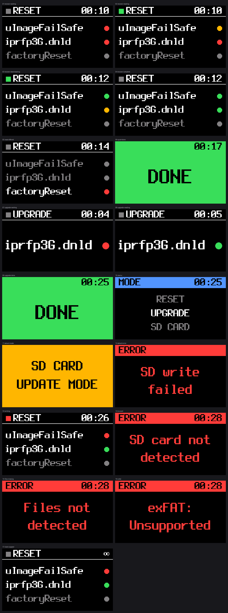

# RFP-USB

Firmware to turn a Waveshare RP2040-GEEK / RP2350-GEEK into a tool for recovering, resetting and upgrading *3rd Gen* Mitel DECT RFPs, i.e the 35, 36, 37 & 43.

**Disclaimer:** RFP-USB has been developed with AI, but meticulously tested by a human.  

## Why?

To factory reset an RFP without access to the original OMM or the password, you have to insert a USB stick with a file on it named `factoryReset`. The RFP will then *delete* the file and reset.

Also from time to time RFPs will brick themselves and won't boot. The recovery procedure is to place a `uImageFailSafe` image and `iprfp3G.dnld` firmware file onto a USB stick, insert it into the RFP and then power it up. The RFP will then boot from the FailSafe image, and then flash the new firmware.

Well, why not stick `uImageFailSafe`, `iprfp3G.dnld` and `factoryReset` on a USB and let the RFP do its thing? Unfortunately that process looks like:

1) Use a PC to add the `factoryReset` file to the USB stick  
2) Insert it into the RFP  
3) The RFP boots from `uImageFailSafe` which is slower than flash  
4) It finds the `factoryReset` file, *deletes* it, resets, and reboots  
5) It slowly boots from `uImageFailSafe` again  
6) It flashes its firmware from `iprfp3G.dnld`

For 50 RFPs, you have to repeat this entire process, including connecting it to a PC, 50 times.

RFP-USB attempts to streamline this process by tracking the state (as best it can) and presenting the relevant files to the RFP at the relevant stage.

## Requirements

- A Waveshare RP2040-GEEK or RP2350-GEEK
- An SD card with a <4GB partition, formatted with FAT32

## Installing / Upgrading

1) Grab the `.uf2` for your board from the [GitHub releases page](https://github.com/marrold/RFP-USB/releases)
2) Insert the USB into the computer whilst pressing and holding the BOOT button, and keep it held for a few seconds.  
3) It should then present itself as USB Mass Storage  
4) Drop the `.uf2` file onto the USB. It will reboot automatically and start running the RFP-USB firmware

## Modes

RFP-USB has 3 different modes. You can swap between modes by long pressing the (only) button, short pressing to cycle between modes, and long pressing again to select.

### SD Card Mode

SD Card Mode allows a host to write to the SD Card directly, so you can update the files as required.

It takes effect immediately after selecting the mode.

### Reset Mode

Reset Mode restores, upgrades and resets an RFP, in that order.

It takes effect on the *next* boot, after selecting the mode.

1) On first boot, the USB stick presents the `uImageFailSafe` image and the `iprfp3G.dnld` firmware file to the RFP  
2) The RFP boots from `uImageFailSafe` and then flashes itself with `iprfp3G.dnld`  
3) USB-RFP will detect that the RFP has stopped reading `iprfp3G.dnld` and wait 20 seconds.  
4) It will force the RFP to re-enumerate, and present just the `factoryReset` file  
5) The RFP will delete the file, factory reset and then reboot  
6) Once power is restored USB-RFP remembers the last stage, and displays **DONE**  
7) On the _next_ power cycle, it'll start again from #1

### Upgrade Mode

Upgrade Mode is for upgrading healthy RFPs, without performing a factory reset. It will present `iprfp3G.dnld` to the RFP on every boot, until the mode is changed. Once the RFP has finished reading the file, it will display **DONE**

It takes effect on the *next* boot, after selecting the mode.

## Usage

1) Connect the RFP-USB to a PC  
2) Select the SD Card Mode (see [Modes](#modes))  
3) Add the `iprfp3G.dnld` and `uImageFailSafe` files of your choice onto the USB stick. **Do not add** `factoryReset`. It's handled by the firmware.  
4) "Eject" the USB, but before removing select Reset or Upgrade Mode from the menu.  
5) With the RFP powered off, insert the USB.  
6) Power up the RFP  
7) Let it do its thing until the display turns green and shows "DONE"

## Building

```sh
docker build -t rfp-usb-build .
docker run --rm -u "$(id -u):$(id -g)" -v "$PWD:/src" rfp-usb-build \
    tools/build-firmware.sh
```

This will output `build/rfp-usb-2040.uf2` and `build/rfp-usb-2350.uf2`. Pass `2040` or `2350` to the script to build a specific image.

## Screen Renders

<a href="docs/screens/all-screens.png">
  
</a>

## License

MIT — see [LICENSE](LICENSE).

For bundled libraries see [THIRD-PARTY.md](THIRD-PARTY.md)
